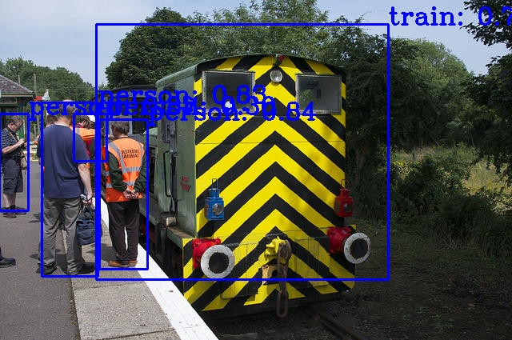
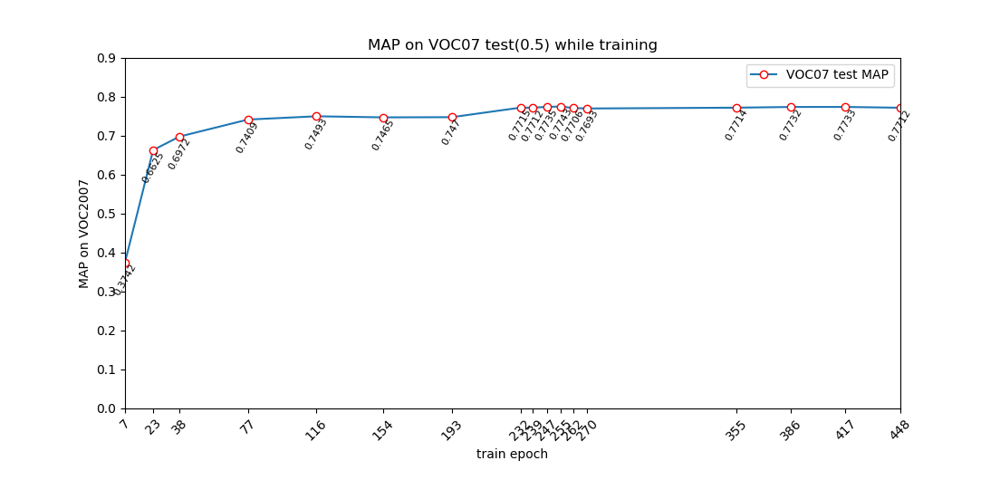
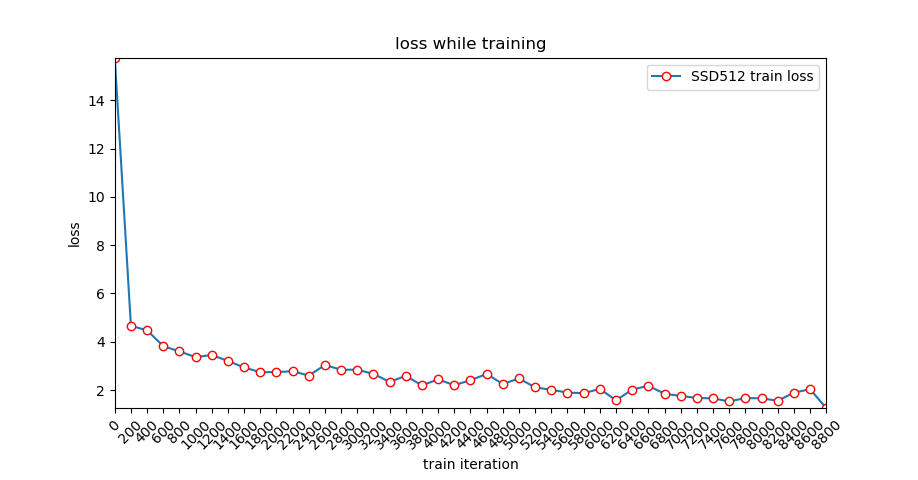
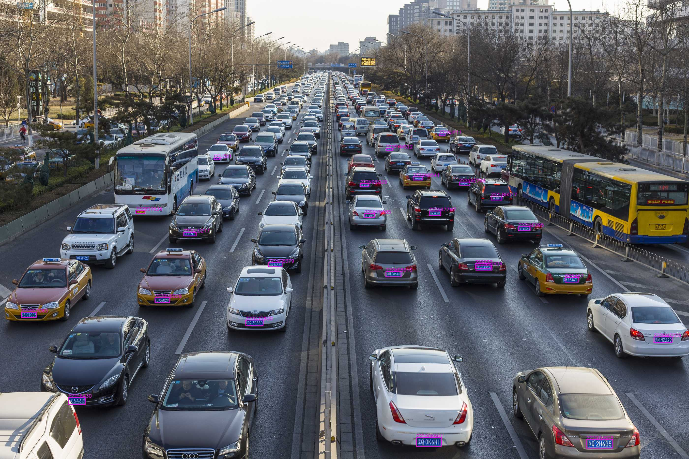
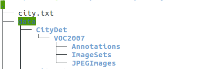

# SSD.Pytorch

Pytorch implementation of [[SSD (Single Shot MultiBox Detector)](https://arxiv.org/abs/1512.02325)]. 

this repository is heavily depend on this implementation [ssd.pytorch](https://github.com/amdegroot/ssd.pytorch).since orginal code is too old to fit the recent version of pytorch. I make some changes , fix some bugs, and give out SSD512  code.

## Environment

python3.7 (python3 may work ok)

pytorch1.3

opencv

## Dataset

Currently I only trained on Pascal VOC dataset and my own plate dataset.

U can make ur own dataset as VOC format and train ur own ssd model.

datasets are put under ./data , u should change the path according in voc0712.py.

## Train

First download the fc-reduced [VGG-16](https://arxiv.org/abs/1409.1556) PyTorch base network weights at: https://s3.amazonaws.com/amdegroot-models/vgg16_reducedfc.pth

By default, we assume you have downloaded the file in the ./weights dir:

```shell
mkdir weights
cd weights
wget https://s3.amazonaws.com/amdegroot-models/vgg16_reducedfc.pth
```

to train VOC or ur own dataset, simply run :

```shell
CUDA_VISIBLE_DEVICES=0 python train.py --input 512 --dataset_root ./data/VOCdevkit --num_class 21 --num_epoch 300 --lr 0.001 --batch_size 16
```

or u can resume ur training from the checkpoint under dir ./weights/

```shell
CUDA_VISIBLE_DEVICES=0 python train.py --input 512 --dataset_root ./data/VOCdevkit --num_class 21 --num_epoch 300 --lr 0.001 --batch_size 16 --resume ./weights/ssd512_VOC_12000.pth
```

## Evaluation

use the eval.py to eval ur model:

```
python eval.py --input 512 --trained_model weights/ssd512_VOC_73000_mAP79.80.pth
```

and you will get results as follows:

AP for aeroplane = 0.8861
AP for bicycle = 0.8694
AP for bird = 0.8078
AP for boat = 0.7698
AP for bottle = 0.6407
AP for bus = 0.8625
AP for car = 0.8825
AP for cat = 0.8671
AP for chair = 0.6424
AP for cow = 0.8712
AP for diningtable = 0.6781
AP for dog = 0.8572
AP for horse = 0.8781
AP for motorbike = 0.8531
AP for person = 0.8091
AP for pottedplant = 0.5479
AP for sheep = 0.8327
AP for sofa = 0.7562
AP for train = 0.8654
AP for tvmonitor = 0.7824
Mean AP = 0.7980

## Demo

u can test single image using demo.py, just change a bit code in demo.py




## Results

  VOC2007 test (0.5) results:

| model  | paper | this implements |
| ------ | ----- | --------------- |
| SSD300 | 77.2  | 77.43           |
| SSD512 | 79.8  | 79.80           |

SSD300 and SSD512 model weights trained with VOC:https://pan.baidu.com/s/1DxlkOQzkFkkdYdNYsDx_MQ code:dd7m





## Train with Customer Dataset

I trained a plate detector with ssd and work pretty well,though with a bit slow latency.


To train your own dataset：

**1）make your dataset as VOC format and put it in ./data/  folder. the dataset path could be arrange as** follows:




JPEGImages folder is all your dataset,Annotations is all your xml labels, and create your own trainval.txt and test.txt under ImageSets/Main , just follow voc format. Above is my own dataset CityDet.

**2) change the dataset parser code ./data/voc0712.py:**

change :

```python
VOC_CLASSES = (  # always index 0
    ur dataset class)
```

change:

```python
VOC_ROOT = osp.join('./', "data/VOCdevkit/")
```

to your own dataset dir:

```python
VOC_ROOT = osp.join('./', "data/CityDet/")
```

change:

```python
image_sets=[('2007', 'trainval'), ('2012', 'trainval')]
```

to:

```python
image_sets=[('2007', 'trainval')]
```

**3)  train with vgg pretrained weights**

Download the fc-reduced [VGG-16](https://arxiv.org/abs/1409.1556) PyTorch base network weights at: https://s3.amazonaws.com/amdegroot-models/vgg16_reducedfc.pth

By default, we assume you have downloaded the file in the ./weights dir:

```shell
mkdir weights
cd weights
wget https://s3.amazonaws.com/amdegroot-models/vgg16_reducedfc.pth
```

run :

```shell
CUDA_VISIBLE_DEVICES=0 python train.py --input 512 --dataset_root ${your dataset dir} --num_class ${your dataset class} --num_epoch 300 --lr 0.001 --batch_size 16
```

for  my CityDet dataset:

```shell
CUDA_VISIBLE_DEVICES=0 python train.py --input 512 --dataset_root ./data/CityDet/ --num_class 22 --num_epoch 300 --lr 0.001 --batch_size 16
```

and you will get start to train your own SSD detector:


